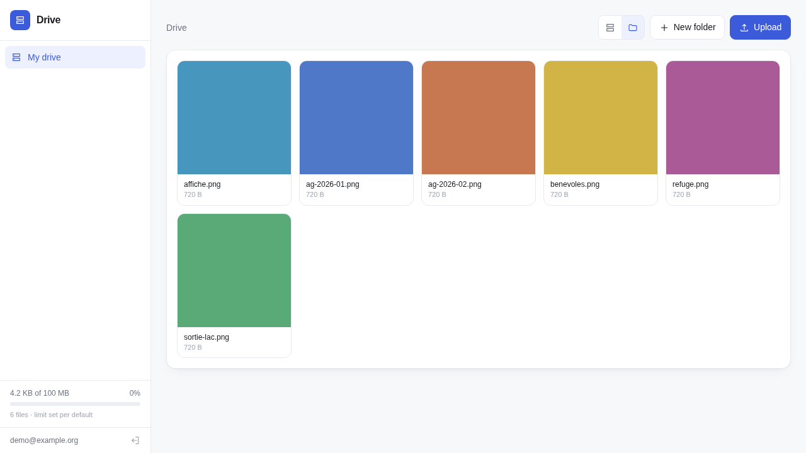

# bkn-drive

A shared drive with a web UI, built entirely on
[**bkn**](https://github.com/javimosch/bkn) — files, folders, per-user quotas,
groups and sharing, with no database and no storage layer of its own.

Single Go binary, embedded React, no build step, no runtime dependencies.



## What it is, and what bkn does

The interesting part is how little of this is application code. The drive
*domain* — entries, paths, quotas, groups, shares — is **two JavaScript files
running inside bkn** (`examples/drive/` in the bkn repo). This binary is the
interface and the session holder; it stores nothing.

| concern | where it lives |
|---|---|
| entries, folders, sharing | bkn store collections |
| per-drive quota, atomic reservation | bkn `$inc` patch operators |
| file bytes | bkn file namespace, private, signed URLs |
| identity, orgs, tokens | bkn auth |
| the drive rules | one bkn script (`drive`) |
| uploads | one bkn hook (`drive-upload`) |
| this repo | sign-in, sessions, previews, the UI |

If you are evaluating bkn: that table is the pitch. A shared drive with
multi-user quotas is a normal backend project, and here it is a script, a
hook, and a UI.

## Run

```sh
go build -o bkn-drive .
BKN_URL=https://your-bkn.example.org ./bkn-drive serve --port 8080
```

`BKN_URL` defaults to `http://127.0.0.1:8804` — a bkn on the same machine.
The server binds loopback unless told otherwise (cli-daemon-spec §1).

You need the drive installed in your bkn first:

```sh
bkn files ns create drive-blobs --signing-key auto
bkn script create drive --file examples/drive/drive.js --run-access user
bkn script create drive-upload --file examples/drive/drive-upload.js
bkn hooks create drive-upload --script drive-upload --max-bytes 26214400 --rate-limit 60
```

## Features

- **Drives**: personal (`user:me`), group, and organisation
- **Quotas** that cascade user → group → org → global, reported with the rule
  that bound them
- **Gallery mode** for image folders, with arrow-key navigation
- **Previews**: images, video, audio, PDF, and ~30 text and code formats
- **Sharing** a single file without granting the drive
- **Auto-login** by bookmarkable key, for a drive you keep open

## Why the token is not in the browser

Sign-in exchanges credentials with bkn and keeps the tokens **in this
process**, behind an opaque `HttpOnly` session cookie. The browser never holds
a bearer token: a token in `localStorage` is one XSS away from someone else's
files, and not-that is the whole promise of a drive.

Sessions persist to disk at `0600` so a deploy does not sign everyone out.
What is stored is a bkn refresh token, which bkn rotates on every use.

## Rate limiting

Sign-in is capped per address (15 / 10 min) and per account, and the
authenticated API per address. `X-Forwarded-For` is honoured **only** when the
direct peer is loopback, and then the *last* entry is used — a client can send
its own header and a proxy appends to it, so the leftmost value is
attacker-controlled.

## Auto-login

```sh
BKN_DRIVE_AUTOLOGIN_EMAIL=you@example.org
BKN_DRIVE_AUTOLOGIN_PASSWORD_FILE=/etc/bkn-drive/autologin.pw   # must be 0600
BKN_DRIVE_AUTOLOGIN_KEY=<32+ random characters>
```

`https://host/?k=<key>` mints a 30-day session and drops the key from the
address bar. **The key is mandatory** and it refuses to start without one: an
auto-login with no key on a public URL does not mean convenient, it means the
drive belongs to whoever finds the hostname.

## Endpoints

| route | does |
|---|---|
| `POST /api/login` `/api/logout` `GET /api/me` | session |
| `POST /api/drive` | one drive op (`ls`, `mkdir`, `rm`, `mv`, `quota`, `share`, …) |
| `POST /api/upload` | multipart file → the `drive-upload` hook |
| `GET /api/download` | 302 to a short-lived signed URL |
| `GET /api/preview` | what the UI needs to show a file inline |

Downloads redirect rather than proxy, so bytes go straight from bkn to the
person. Uploads cannot: bkn's hook takes base64 in JSON, so the file passes
through memory here — hence the 25MB cap.

Administrative ops (`policy-set`) are deliberately not exposed; they need
bkn's admin token, which this server does not hold.

## Storage

Blobs live in bkn's `drive-blobs` namespace. bkn's local backend follows
`BKN_FILES_DIR` and it also has an S3 backend, so moving the bytes elsewhere
is a bkn-side decision that needs no change here.

## Conventions

Follows the [agent-first CLI specs](https://cli-specs.intrane.fr):
cli-output-spec (JSON on stdout, context on stderr, semantic exit codes,
`help-json`), cli-guide-spec (`bkn-drive guide`), cli-daemon-spec
(`serve`, `/_health`, `daemon start|stop|status`).

## Licence

MIT.
